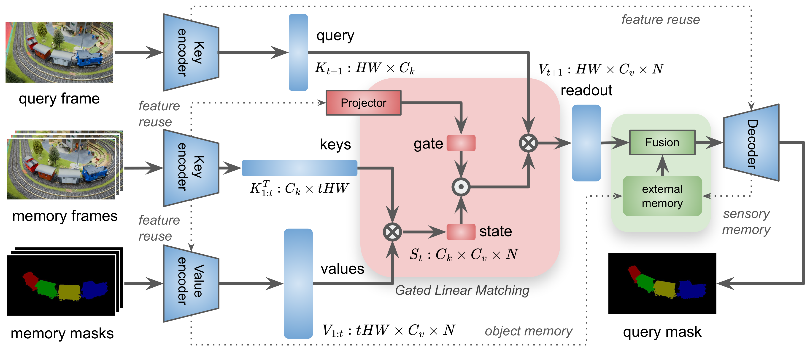

# LiVOS: Light Video Object Segmentation with Gated Linear Matching
Pytorch implementation for paper [LiVOS: Light Video Object Segmentation with Gated Linear Matching](https://arxiv.org/), arXiv 2024. <br>

Qin Liu<sup>1</sup>, 
Jianfeng Wang<sup>2</sup>, 
Zhengyuan Yang<sup>2</sup>, 
Linjie Li<sup>2</sup>, 
Kevin Lin<sup>2</sup>, 
Marc Niethammer<sup>1</sup>, 
Lijuan Wang<sup>2</sup> <br>
<sup>1</sup>UNC-Chapel Hill, <sup>2</sup>Microsoft
#### [Paper](https://arxiv.org/)

<p align="center">
  
</p>


## Installation
The code is tested with ``python=3.10``, ``torch=2.4.0``, ``torchvision=0.19.0``.
```bash
git clone https://github.com/uncbiag/LiVOS
cd LiVOS
```
Create a new conda environment and install required packages accordingly.
```bash
conda create -n livos python=3.10
conda activate livos
conda install pytorch==2.4.0 torchvision==0.19.0 torchaudio==2.4.0 pytorch-cuda=12.1 -c pytorch -c nvidia
pip install -r requirements.txt
```

## Weights
Download the model weights and store them in the ./weights directory. The directory will be automatically created if it does not already exist.
```bash
python ./download.py
```

## Datasets
| Dataset   |                      Description             |           Download Link              |
|-----------|----------------------------------------------|:------------------------------------:|
|DAVIS 2017 |  60 videos (train); 30 videos (val); 30 videos (test) |  [official site][d17]|
|YouTube VOS 2019  |  3471 videos (train); 507 videos (val)     |  [official site][y19]|
|MOSE  |  3000 videos (train); 100 videos (val)     |  [official site][mose]|
|LVOS (v1)*  |  50 vidoes (val); 50 videos (test)     |  [official site][lvos]|


[d17]: https://davischallenge.org/
[y19]: https://youtube-vos.org/
[mose]: https://henghuiding.github.io/MOSE/
[lvos]: https://lingyihongfd.github.io/lvos.github.io/


(*) To prepare LVOS, you need to extract only the first annotations for its validation set:
```bash
python scripts/data/preprocess_lvos.py ../LVOS/valid/Annotations ../LVOS/valid/Annotations_first_only
```

Prepare the datasets in the following structure:
```
├── LiVOS (codebase)
├── DAVIS
│   └── 2017
│       ├── test-dev
│       │   ├── Annotations
│       │   └── ...
│       └── trainval
│           ├── Annotations
│           └── ...
├── YouTube
│   ├── all_frames
│   │   └── valid_all_frames
│   ├── train
│   └── valid
├── LVOS
│   ├── valid
│   │   ├──Annotations
│   │   └── ...
│   └── test
│       ├──Annotations
│       └── ...
└── MOSE
    ├── JPEGImages
    └── Annotations
```

## Evaluation
You should get the following results using our provided models:
<table>
    <thead align="center">
        <tr>
            <th rowspan="2"><span style="font-weight:bold">Training</span><br><span style="font-weight:bold">Dataset</span></th>
            <th rowspan="2">Model</th>
            <th colspan="6">J&F</th>
        </tr>
        <tr>
            <td>MOSE</td>
            <td>DAVIS-17 val</td>
            <td>DAVIS-17 test</td>
            <td>YTVOS-19 val</td>
            <td>LVOS val</td>
            <td>LVOS test</td>
        </tr>
    </thead>
    <tbody align="center">
        <tr>
            <td rowspan="1">D17+YT19</td>
            <td align="left"><a href="https://drive.google.com/uc?export=download&id=1tG_BxCTWp_o9YH0vBqZqLC9KBsEGSsaH">livos-nomose-480p (135 MB)</a></td>
            <td>59.2</td>
            <td>84.4</td>
            <td>78.2</td>
            <td>79.9</td>
            <td>50.6</td>
            <td>44.6</td>
        </tr>
        <tr>
            <td rowspan="1">D17+YT19</td>
            <td align="left"><a href="https://drive.google.com/uc?export=download&id=1ToIDo6PIYF7lQGfO4F7HuHneyatKGWnx">livos-nomose-ft-480p (135 MB)</a></td>
            <td>58.4</td>
            <td>85.1</td>
            <td>81.0</td>
            <td>81.3</td>
            <td>51.2</td>
            <td>50.9</td>
        </tr>
        <tr>
            <td rowspan="1">D17+YT19+MOSE</td>
            <td align="left"><a href="https://drive.google.com/uc?export=download&id=13FVuxcEwNRfY70PA3O9pOyPO7Gx7Zl5N">livos-wmose-480p (135 MB)</a></td>
            <td>64.8</td>
            <td>84.0</td>
            <td>79.6</td>
            <td>82.6</td>
            <td>51.2</td>
            <td>47.0</td>
        </tr>
    </tbody>
</table>

1. To run the evaluation:
```bash
python livos/eval.py dataset=[dataset] weights=[path to model file]
```
Example for DAVIS 2017 validation set (more dataset options in ```livos/config/eval_config.yaml```):
```bash
python livos/eval.py dataset=d17-val weights=./weights/livos-nomose-480p.pth
```

2. To get quantitative results for DAVIS 2017 validation:
```bash
GT_DIR=../DAVIS/2017/trainval/Annotations/480p
Seg_DIR=./results/d17-val/Annotations
python ./vos-benchmark/benchmark.py -g ${GT_DIR} -m ${Seg_DIR}
```

3. For results on other datasets,
- DAVIS 2017 test-dev: [CodaLab](https://codalab.lisn.upsaclay.fr/competitions/6812)
- YouTubeVOS 2019 validation: [CodaLab](https://codalab.lisn.upsaclay.fr/competitions/7683)
- LVOS val: [LVOS](https://github.com/LingyiHongfd/lvos-evaluation)
- LVOS test: [CodaLab](https://codalab.lisn.upsaclay.fr/competitions/8767)
- MOSE val: [CodaLab](https://codalab.lisn.upsaclay.fr/competitions/10703)


## Training
We conducted the training on four A6000 48GB GPUs. Without MOSE, the process required approximately 90 hours to complete 125,000 iterations.

```
OMP_NUM_THREADS=4 torchrun --master_port 25350 --nproc_per_node=4 livos/train.py exp_id=first_try model=base data=base
```
- The training configuration is located in ```livos/config/train_config.yaml```.
- By default, the output folder is set to ```./model_mmdd_yyyy/${exp_id}```. If needed, this can be modified in the training configuration file.

## Citation
```bibtex
@article{liu2024livos,
  title={LiVOS: Lite Video Object Segmentation with Gated Linear Matching},
  author={Liu, Qin and Wang, Jianfeng and Yang, Zhengyuan and Li, Linjie and Lin, Kevin and Niethammer, Marc and Wang, lijuan},
  journal={arXiv preprint arXiv:},
  year={2024}
}
```

## Acknowledgement

Our project is developed based on [Cutie](https://github.com/hkchengrex/Cutie). We appreciate the well-maintained codebase.
